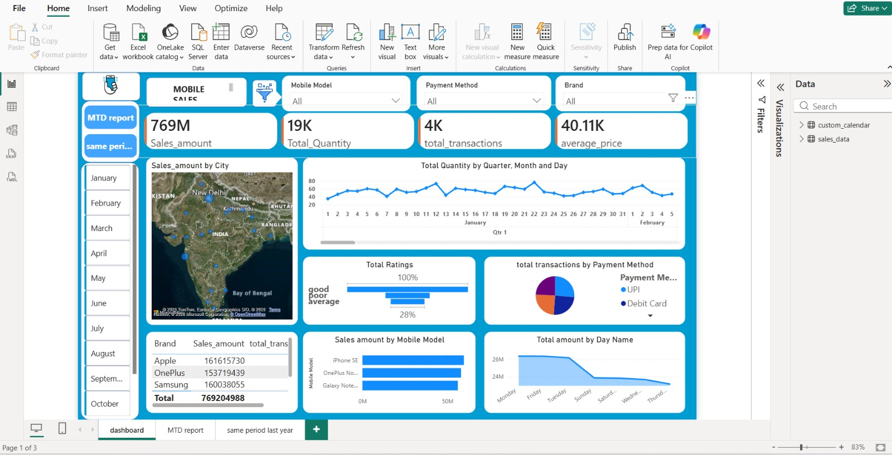
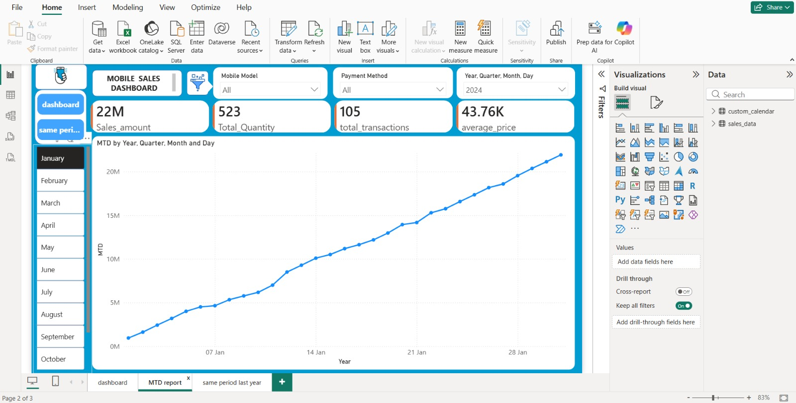
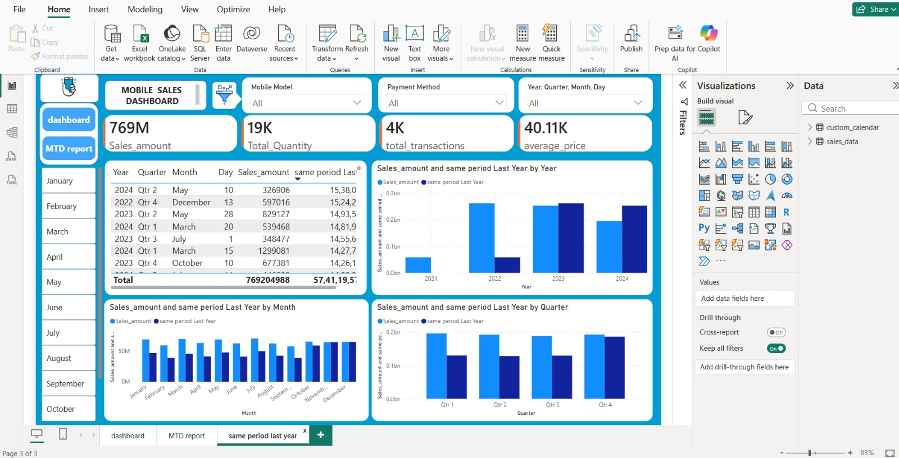

# 📱 Mobile Sales Dashboard using Power BI

An interactive **Power BI dashboard** built to analyze mobile sales performance across different brands, cities, payment methods, and customer ratings. The dashboard provides meaningful business insights through dynamic visualizations, KPIs, and interactive filters, enabling data-driven decision-making.

---

## 📌 Project Overview

This project focuses on analyzing mobile sales data to identify sales trends, customer purchasing behavior, and business performance. Using Power BI, the raw data was transformed into an interactive dashboard that allows users to explore key metrics and gain valuable insights.

---

## 🚀 Tech Stack

- 📊 Power BI
- 🗄️ SQL
- 📑 Microsoft Excel
- ⚡ DAX (Data Analysis Expressions)
- 🔄 Power Query

---

## 📊 Dashboard Highlights

- ✔️ Interactive Dashboard with Slicers
- ✔️ Sales Analysis by Brand
- ✔️ City-wise Sales Performance
- ✔️ Mobile Model Analysis
- ✔️ Payment Method Distribution
- ✔️ Customer Rating Analysis
- ✔️ Monthly Sales Trends
- ✔️ Dynamic KPI Cards

---

## 📈 Key Performance Indicators (KPIs)

- 💰 Total Sales
- 📦 Total Quantity Sold
- 🛒 Total Transactions
- ⭐ Average Customer Rating
- 📉 Monthly Sales Trend

---

## 🔍 Business Insights

- Identified the top-performing mobile brands and models.
- Compared sales performance across multiple cities.
- Analyzed customer purchasing behavior using different payment methods.
- Evaluated customer satisfaction through ratings.
- Enabled faster business decisions with interactive visualizations.

---

## 🛠️ Data Processing

- Cleaned and transformed raw data using **Power Query**.
- Built calculated columns and measures using **DAX**.
- Created an optimized data model for efficient reporting.
- Designed an interactive dashboard for business users.

---

## 📂 Repository Contents

```
📁 PowerBi-Mobiles-Sales-Dashboard
│── 📄 Mobiles Sales Dashboard.pbix
│── 📄 README.md
```

---

## 📸 Dashboard Preview

### Dashboard Overview
<p align="center">
  
</p>

### Sales Analysis
<p align="center">
  
</p>

### Customer & Payment Analysis
<p align="center">
  
</p>

---

## 🎯 Skills Demonstrated

- Power BI Dashboard Development
- Data Cleaning & Transformation
- Data Modeling
- DAX Calculations
- Power Query
- SQL
- Business Intelligence
- Data Visualization
- KPI Development
- Analytical Thinking

---

## 👨‍💻 Author

**Mettu Anthony Srejan Reddy**

- GitHub: https://github.com/SrejanReddy6982

---
